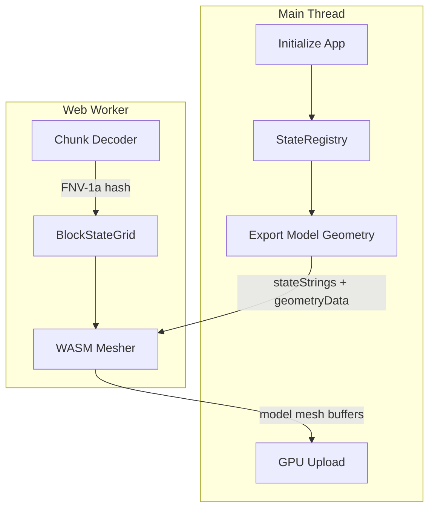

# Model Mesh Pipeline

This document describes the end-to-end pipeline for generating model block meshes (slabs, stairs, plants, etc.) in the Block Viewer.

## Architecture Overview

Model meshing occurs in **Web Workers** using **WASM** for maximum performance. The main thread only handles GPU buffer uploads.



## Data Flow

### 1. Initialization (Main Thread)

During app startup, the main thread prepares model geometry data:

1. **StateRegistry** pre-registers all non-cube block states
2. **Geometry computation** - Resolves block models from JSON files
3. **Export for WASM** - Serializes state strings and pre-baked geometry

```javascript
// StateRegistry exports state strings and geometry
const modelExport = stateRegistry.exportHashModelGeometryForWasm(textureIndexLookup);
// Result: { stateStrings: "minecraft:oak_slab[half=bottom]\\n...", geometryData: Uint8Array }
```

### 2. Worker Initialization

Workers receive the model data and initialize the WASM hash-based registry:

```javascript
wasmModule.init_hash_model_registry(stateStringsJoined, geometryData);
```

The WASM module computes FNV-1a hashes for each state string and stores geometry indexed by hash.

### 3. Chunk Processing (Worker)

When a chunk is decoded:

1. **Parse NBT** - Extract block palette and section data
2. **Compute state hashes** - For each non-cube block, compute FNV-1a hash
3. **Store in BlockStateGrid** - Hash indexed by position

```javascript
const stateString = buildStateString(blockName, properties);
const hash = fnv1aHash(stateString);  // e.g., 0xABCD1234...
stateGrid.setStateHash(sectionKey, index, hash);
```

### 4. WASM Model Meshing

The WASM mesher iterates over the state grid:

```rust
for (key, section) in state_grid.iter_sections_with_states() {
    for block in section {
        let hash = section[idx];
        let model = get_model_geometry_by_hash(hash)?;  // Hash lookup
        emit_face_geometry(model, world_pos, light);
    }
}
```

### 5. Result Transfer

WASM returns model mesh buffers directly:

```javascript
// Worker receives from WASM
result.model_opaque_positions  // Float32Array
result.model_opaque_normals    // Float32Array
result.model_opaque_uvs        // Float32Array
// ... etc
```

### 6. GPU Upload (Main Thread)

Main thread receives complete mesh buffers and uploads to GPU:

```javascript
const geometry = new THREE.BufferGeometry();
geometry.setAttribute('position', new THREE.Float32BufferAttribute(positions, 3));
// ... other attributes
const mesh = new THREE.Mesh(geometry, material);
```

## Hash Function Specification

Both JavaScript and Rust use FNV-1a 64-bit hashing:

```
FNV_OFFSET_BASIS = 0xcbf29ce484222325
FNV_PRIME = 0x00000100000001B3

hash = FNV_OFFSET_BASIS
for each byte in string:
    hash = hash XOR byte
    hash = hash * FNV_PRIME (wrapping)
return hash
```

**Critical:** Both implementations MUST produce identical hashes for the same input.

### JavaScript Implementation

```javascript
const FNV_OFFSET_BASIS = 0xcbf29ce484222325n;
const FNV_PRIME = 0x100000001b3n;

function fnv1aHash(str) {
  let hash = FNV_OFFSET_BASIS;
  for (let i = 0; i < str.length; i++) {
    hash ^= BigInt(str.charCodeAt(i));
    hash = (hash * FNV_PRIME) & 0xFFFFFFFFFFFFFFFFn;
  }
  return hash;
}
```

### Rust Implementation

```rust
const FNV_OFFSET_BASIS: u64 = 0xcbf29ce484222325;
const FNV_PRIME: u64 = 0x00000100000001B3;

pub fn hash_state_string(state: &str) -> u64 {
    let mut hash = FNV_OFFSET_BASIS;
    for byte in state.bytes() {
        hash ^= byte as u64;
        hash = hash.wrapping_mul(FNV_PRIME);
    }
    hash
}
```

## State String Format

State strings follow Minecraft's canonical format:

```
minecraft:oak_stairs[facing=north,half=bottom,shape=straight]
```

Properties are sorted alphabetically for consistent hashing.

## Performance Characteristics

| Metric | Main Thread Fallback | WASM Pipeline |
|--------|---------------------|---------------|
| Meshing time | ~421ms | ~206ms |
| Min FPS during nav | ~18 | ~38+ |
| Main thread blocked | Yes | No |

## Troubleshooting

### Models not rendering

1. Check if WASM model registry initialized:
   ```
   [SuperChunkWorker] WASM HASH-BASED model registry initialized with N states
   ```

2. Verify hash function match - hashes must be identical in JS and Rust

### Poor performance

1. Check for main thread fallback:
   - If `result.grids` is set, WASM didn't produce model vertices
   - Main thread will build models (slow)

2. Verify `wasmModelsIncluded` is `true` in mesh results

### Hash mismatch debugging

Add logging to compare hashes:
```javascript
const jsHash = fnv1aHash(stateString);
const wasmHash = wasmModule.compute_state_hash(stateString);
console.log(`JS=${jsHash} WASM=${wasmHash} match=${jsHash === BigInt(wasmHash)}`);
```

## Files Reference

| File | Purpose |
|------|---------|
| `src/assets/StateRegistry.js` | State registration and geometry export |
| `src/mesh/workers/SuperChunkWorker.js` | Worker-side hash computation |
| `src/wasm-mesher/src/models/registry.rs` | WASM hash-based registry |
| `src/wasm-mesher/src/models/mesher.rs` | WASM model mesh generation |
| `src/viewer/SuperChunkManager.js` | Main thread mesh upload |
