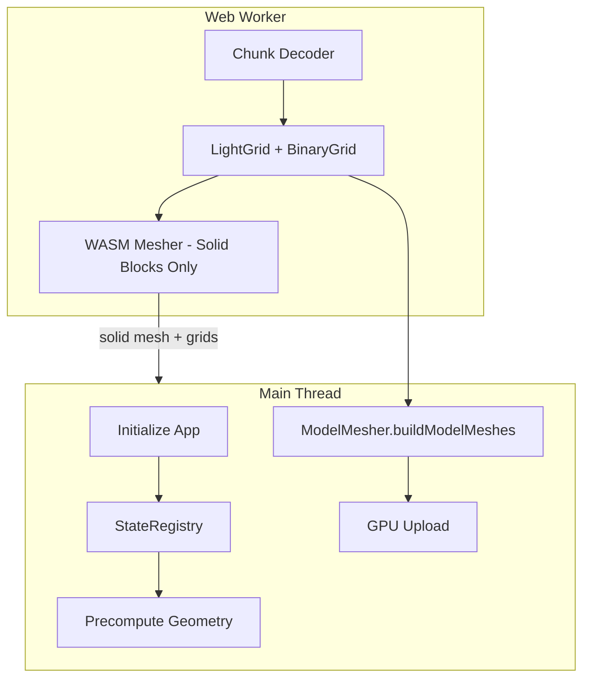

# Model Mesh Pipeline

This document describes the end-to-end pipeline for generating model block meshes (slabs, stairs, plants, etc.) in the Block Viewer.

## Current Architecture (JavaScript-based)

Model meshing is currently handled entirely in **JavaScript on the main thread**. WASM is used only for solid cube block meshing.



## Data Flow

### 1. Initialization (Main Thread)

During app startup, the StateRegistry pre-registers and precomputes geometry for non-cube blocks:

```javascript
// StateRegistry registers block states
stateRegistry.register(blockName, properties, geometry);

// Precompute geometry for all registered states
stateRegistry.precomputeAll();
```

### 2. Worker Processing

Workers decode chunks and run WASM meshing for **solid blocks only**:

```javascript
// Worker decodes chunk NBT
const { grid, lightGrid } = decodeChunk(chunkData);

// WASM meshes only solid cubes
const solidMesh = wasmModule.mesh_chunk(gridData, lightData);

// Return grids to main thread for model meshing
return { solidMesh, grid, lightGrid };
```

### 3. Main Thread Model Building

When worker results arrive, the main thread builds model meshes:

```javascript
// SuperChunkManager receives worker result
const modelResult = ModelMesher.buildModelMeshes(
  grid,           // Block grid from worker
  lightGrid,      // Light data from worker
  stateRegistry,  // Pre-computed geometry
  textureAtlas,   // Texture coordinates
  bounds          // Chunk bounds
);
```

### 4. GPU Upload

Both solid and model meshes are uploaded to GPU:

```javascript
const solidGeometry = createBufferGeometry(solidMesh);
const modelGeometry = createBufferGeometry(modelResult);
scene.add(new THREE.Mesh(solidGeometry, material));
scene.add(new THREE.Mesh(modelGeometry, material));
```

## Key Files

| File | Purpose |
|------|---------|
| `src/assets/StateRegistry.js` | Block state registration and geometry storage |
| `src/mesh/ModelMesher.js` | Main thread model mesh generation |
| `src/mesh/workers/SuperChunkWorker.js` | Worker for chunk decode + solid meshing |
| `src/viewer/SuperChunkManager.js` | Coordinates workers and main thread |
| `src/wasm-mesher/` | Rust/WASM solid block meshing only |

## Performance Characteristics

| Metric | Current JS Pipeline |
|--------|---------------------|
| Model meshing | ~300-500ms for initial load |
| Main thread blocked | Yes, during model building |
| Solid block meshing | Fast (WASM) |

## Future: WASM Model Meshing

A WASM-based model meshing implementation was attempted but reverted due to hash synchronization issues between JavaScript and Rust. Key challenges:

1. **Hash Function Consistency** - FNV-1a hash must produce identical results in JS and Rust
2. **State String Format** - Properties must be sorted identically
3. **Geometry Serialization** - Pre-baked geometry must be correctly deserialized in Rust

To reattempt WASM model meshing, see:
- Commit `d953cd5` - Original WASM model meshing implementation
- Commits `d953cd5..669aada` - Various fix attempts

### WASM Model Meshing Requirements

1. **Identical Hash Functions**
   ```javascript
   // JavaScript
   function fnv1aHash(str) {
     let hash = 0xcbf29ce484222325n;
     for (const byte of str) {
       hash ^= BigInt(byte.charCodeAt(0));
       hash = (hash * 0x100000001b3n) & 0xFFFFFFFFFFFFFFFFn;
     }
     return hash;
   }
   ```
   
   ```rust
   // Rust - MUST match exactly
   fn hash_state_string(state: &str) -> u64 {
       let mut hash = 0xcbf29ce484222325u64;
       for byte in state.bytes() {
           hash ^= byte as u64;
           hash = hash.wrapping_mul(0x00000100000001B3);
       }
       hash
   }
   ```

2. **State String Canonicalization**
   - Always use `minecraft:` prefix
   - Sort properties alphabetically
   - Format: `minecraft:block_name[prop1=val1,prop2=val2]`

3. **Testing Hash Consistency**
   ```javascript
   const testStr = 'minecraft:oak_stairs[facing=north,half=bottom,shape=straight]';
   const jsHash = fnv1aHash(testStr);
   const wasmHash = wasmModule.compute_state_hash(testStr);
   console.assert(jsHash === wasmHash, 'Hash mismatch!');
   ```

## Troubleshooting

### Models not rendering

1. Check if `StateRegistry.precomputeAll()` completed
2. Verify `ModelMesher.buildModelMeshes` is being called
3. Check for errors in console about missing geometries

### Slow model building

1. Model building happens on main thread - expected to block
2. Consider deferring model meshes during initial load
3. Profile with `window.__frameCostEnabled = true`

### Missing block types

1. Ensure block is registered in `StateRegistry`
2. Check if block model JSON exists in texture pack
3. Verify `BlockstateResolver` can resolve the state
